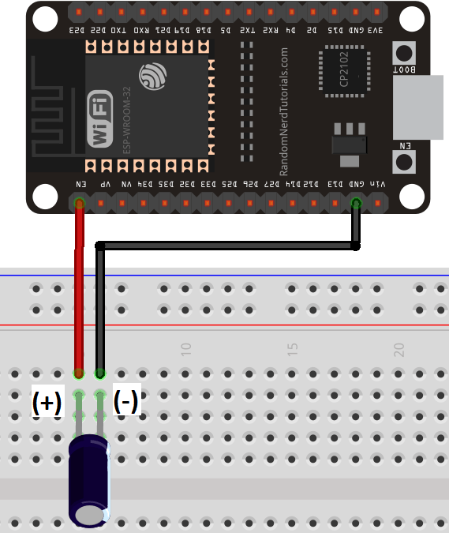

## README

### Requirements
* Python +2.7
* ESP-32
* x2 100 ohm resistors
* x1 100 uF capacitor
* x1 LED
* Breadboard
* Jumper wires

### Schematics

### Notes

* uPyCraft IDE is used to upload the source code into esp32.
* [Intsalling firmware into esp32](https://randomnerdtutorials.com/flash-upload-micropython-firmware-esp32-esp8266/)

