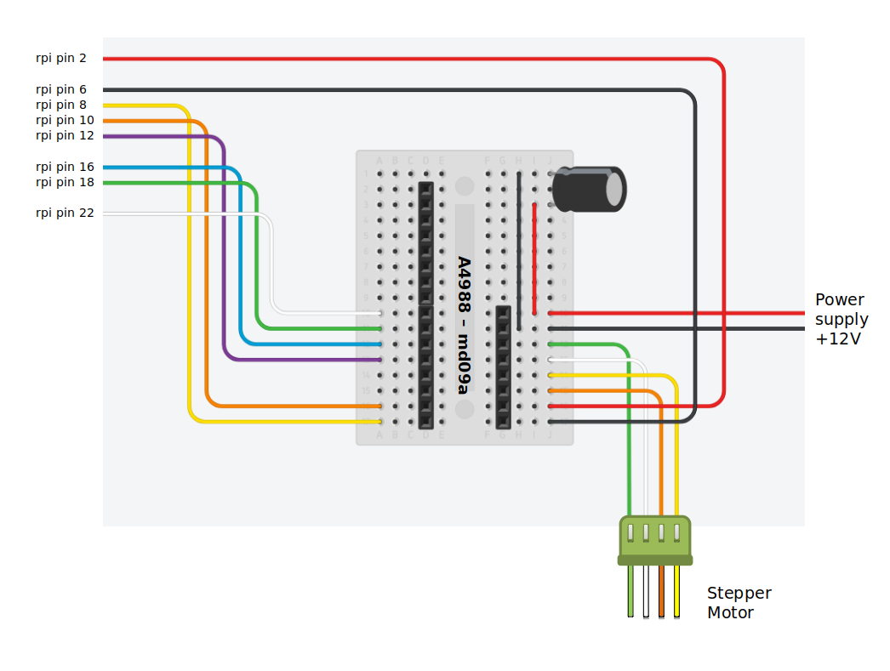
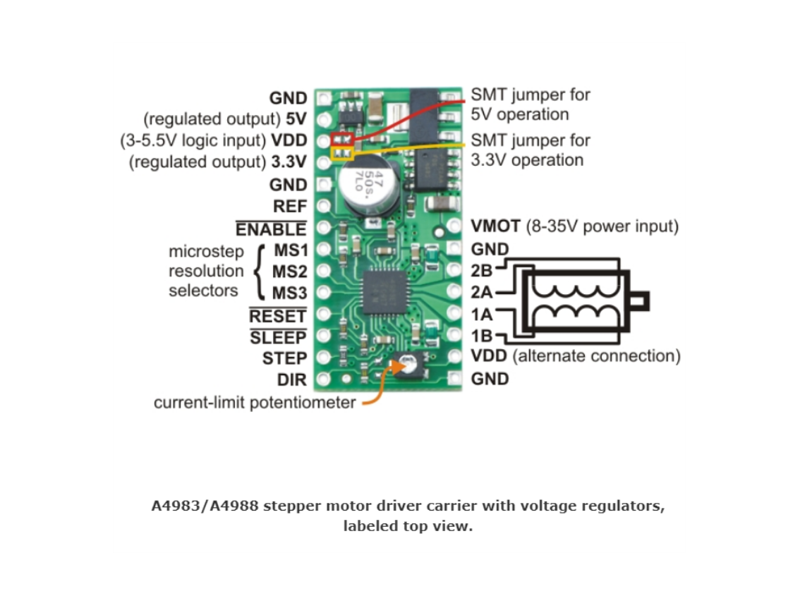

# Conveyor Belt


The conveyor belt is moved by a stepper motor, which is controlled by a Raspberry Pi over a A4988 stepper motor driver. You can find more information about the nodejs library for the A4988 after the Raspberry Pi Configuration. 

## Exposed Thing implementation based on: Exposed Thing with node-wot as Dependency


### Raspberry Pi Configuration

You can find more information about the following steps here:  
* [](https://gpiozero.readthedocs.io/en/stable/remote_gpio.html)   
* [](https://www.npmjs.com/package/pigpio)

```
1)  npm install
2)  (npm install pigpio) -> already included in package.json
3)  Raspberry Pi Configuration -> Enable remote connections -> Remote GPIO: enable
4)  npm run build
5)  instead of npm run start -> sudo npm run start
```
In case of some problems with sudo npm run start, try:
```
sudo shutdown -r 0 
```
and wait until the rpi is ready. 


# A4988
Use an A4988 stepper motor controller on a Raspberry Pi with node.js

You can find more about the original files here:
[](https://github.com/echicken/A4988)

#### The following changes were added in the pydobot library

The following lines contain the original code (commented out) and some lines that have been added or changed for the purpose to not only turn the stepper motor for a certain number of steps, but to start the stepper motor with the start command and to stop it with the stop command.

    // _turn(steps, res) {
    _turn(res) {
        if (this._abort) {
            this._turning = false;
            res(this._steps);
            return;
        }
        // this._steps++;
        this._step.digitalWrite(true);
        this._step.digitalWrite(false);
        // if (this._steps == steps) {
            // this._turning = false;
        //     res(this._steps);
        //     return;
        // }
        // setTimeout(() => this._turn(steps, res), this._delay);
        setTimeout(() => this._turn(res), this._delay);
    }

    turn(steps = 1, callback) {
        if (this._turning) return Promise.reject(new Error('Motor already running'));
        this._steps = 0;
        this._abort = false;
        this._turning = true;
        if (typeof callback == 'function') {
            // this._turn(steps, callback);
            this._turn(callback);
        } else {
            // return new Promise(res => this._turn(steps, res));
            return new Promise(res => this._turn(res));
        }
    }

### Use the library

```javascript
const A4988 = require('A4988');
const a4988 = new A4988({ step: 6, dir: 5 });
```

### Constructor

```javascript
new A4988({ step: 26, dir: 19, ms1: 13, ms2: 6, ms3: 5, enable: 22 }); // ms1, ms2, ms3, and enable are optional
```

All parameters are BCM GPIO pin numbers wired to the corresponding A4988 pins.

The _ms1_, _ms2_, and _ms3_ parameters are optional, but required if you want microstepping (_step_size_ below).

### Properties

* **direction** - _boolean_ - Clockwise or counterclockwise, depending on wiring
* **delay** - _number_ - Milliseconds between steps (pulses) (default is 1)
* **step_size** - _string_ - 'full', 'half', 'quarter', 'eighth', or 'sixteenth'
    * ms1, ms2, and ms3 must be wired up and provided to constructor
* **enabled** - _boolean_ - Enable or disable the controller. Set 'true' to enable (default), 'false' to disable. This is at odds with how the pin actually works (active-low) but is clearer.

### Methods

* **turn(1 _[, callback]_)** - Will fire _callback_ when turn is complete (or aborted).  If _callback_ not given, returns a Promise
* **turn_step_size(tss)** - tss = step_size-string-format like above
* **turn_speed(s)** - s = delay-number-format like above
* **turn_direction(td)** - td = direction-boolean-format like above
* **stop()** - Abort a turn in progress
* **enable()** - boolean-format like above
* **disable()** - boolean-format like above

### Autostart execution Raspberry Pi

Use the following terminal command:
```
crontab -e
```
Write the commands that need to be executed at the reboot of the Raspberry Pi.
Example text:

```
@reboot sleep 10 && ~/Desktop/FolderOfTheThingProgram && npm run start
```
Save and close.

### Schematics






