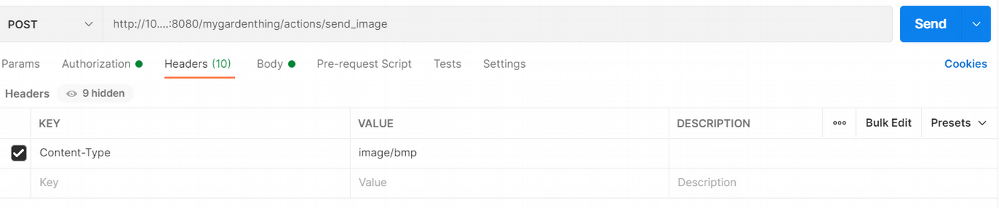

### Problem:
Thing description standard uses JSON for describing the specs of the thing but this limits the definitions to spectrum of JSON types. This is also true for input of actions. There is no defined literature for unstructured data formats such as imagesd that is not JSON. 
&nbsp;
#### Problem Context:

Scrollphathd is a simple IoT device with a display of size 17x7. It runs a flask server and when it receives a bmp image, it displays the image for 10 seconds. It can currently work only with bmp images of size 17x7 with bpp value of 8. 
&nbsp;

### Possible solutions: 

* **Describing the expected input in “description” field:**
As in a regular programming API explaining the specs of the input in “description:” field and hold the back-end application 
##### Example TD: 

```
{
    "@context": "https://www.w3.org/2019/wot/td/v1",
    "id": "urn:ex:thing",
    "actions": {
      "send_image": {
        "input": {
          "description": "a bmp image with 17 pixels wide and 7 pixels long with bpp value of 8 that uses no compression.Maximum size of the image is 1220kB"    
        },
        "forms": [
          {
            "href": "/send_image",
            "op": "invokeaction",
            "htv:methodName": "POST",
            "contentType": "image/bmp"
          
          }
        ]
      }
    }
}

```
##### Example Client Request:
&nbsp;
&nbsp;
* **Sending the input image as a JSON object and defining new keywords for input check:** 
Sending each input in JSON object format. An example could be converting the file into a hexadecimal string in the Consumer side, sending this payload as a JSON and expect the back-end application handle the necessary conversions. Steps for such example is: 
1. In Thing Description under the “input:” of the relative “action:”, define the “type:” as “object” and "contentMediaType:" according to the type of input file (image/bmp in example).
2. For input check under “properties” field define the keywords of "width", "length", "bpp", “maxSize”, "payload","contentMediaType". The hexadecimal representation of the image will be set to value of the “payload” field. The other properties can be checked with simple string operations applied to the payload. For example "contentMediaType" can be checked looking at the value of the first 2 bytes of the “payload”.
3. As the the Consumer side convert the input image that will be sent into a hexadecimal string and set this string as the value of “payload” field of the input.
4. On the back-end application, after doing necessary input checks, convert the payload to its original image format according to "contentMediaType" if needed.
>Note: Since the back-end application can do the necessary checks with string operations to any type of image, the keywords do not require and logic implementation within Thing Description Standard.

##### Example TD:

```
{
  "@context": "https://www.w3.org/2019/wot/td/v1",
  "id": "urn:ex:thing",
  "actions": {
    "send_image": {
      "input": {
        "description": "a bmp image with size 5x3 displayed on scrollphat in hexadecimals.",
        "type":  "object",
        "properties":{
            "width":{
              "type": "integer",
              "maximum": 5
            },
            "length":{
              "type": "integer",
              "maximum": 3
            },
            "bpp":{
              "type": "integer",
              "maximum": 3,
              "minimum": 3
            },
            "maxSize":{
              "type": "number",
              "maximum": 1.2,
              "unit": "kB"
            },  
            "payload":{
                "description": "hexadecimal representation of the image",
                "type": "string"
            },
            "contentMediaType": "image/bmp" 
        },
        "required": ["payload"]
               
      },
      "forms": [
        {
          "href": "/send_image",
          "op": "invokeaction",
          "htv:methodName": "POST",
          "contentType": "application/json"
        
        }
      ]
    }
  }
}
```
##### Example Client Request:

&nbsp;
&nbsp;
* **Sending the input image in its original format and defining new built-in keywords for input check:**
```
{
    "@context": "https://www.w3.org/2019/wot/td/v1",
    "id": "urn:ex:thing",
    "actions": {
      "send_image": {
        "input": { 
          "description": "displays the image on scrollphat"
        },
        
        "forms": [
          {
            "href": "/send_image",
            "op": "invokeaction",
            "htv:methodName": "POST",
            "contentType": "image/bmp",
            "maxsize":{"const": 12.2},
            "width”" : {"const":17},
            "length" : {"const": 7}
  
          }
        ]
      }
    }
  }

```
> Note: This method will require various built-in implementations for new keywords depending on the image format that is used.

##### Example Client Request:
&nbsp;
&nbsp;
* **Abstracting the input data.**
Instead of using direct hexadecimal translation as in b, represent the file in other ways. A simple example is representing rows of an image with a JSON array. Each item in the JSON array can set the brightness values of the pixels of the relative row in the image. The logic of abstraction of the input needs to be handled on the back-end application.
##### Example TD:
```
{
    "@context": "https://www.w3.org/2019/wot/td/v1",
    "id": "urn:ex:thing",
    "actions": {
      "send_image": {
        "input": {
          "description": "a bmp image with size 5x3 displayed on scrollphat in hexadecimal string format.",
          "type":  "array",
          "items":{
            "type": "string",
            "minItems": 3,
            "maxItems":3,
            "minLength": 5,
            "maxLength": 5
          }
        },
        "forms": [
          {
            "href": "/send_image",
            "op": "invokeaction",
            "htv:methodName": "POST",
            "contentType": "application/json"
          
          }
        ]
      }
    }
}
```
##### Example Client Request:

