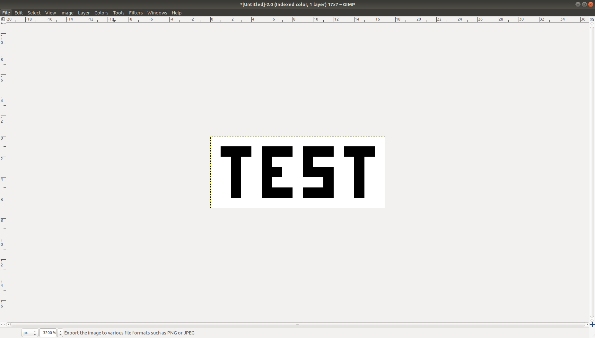
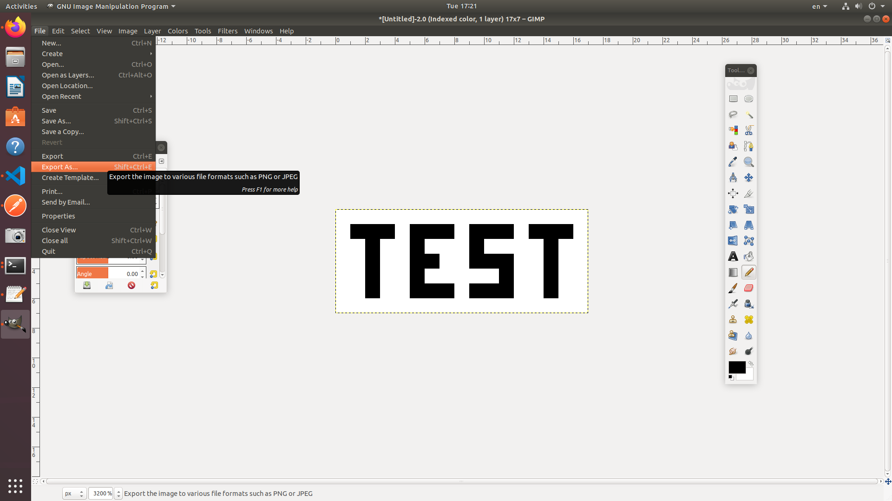
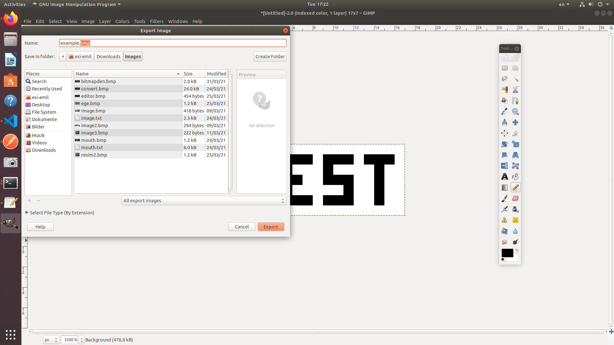
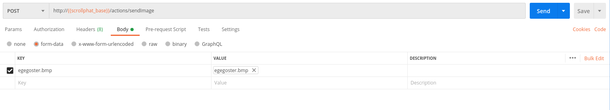
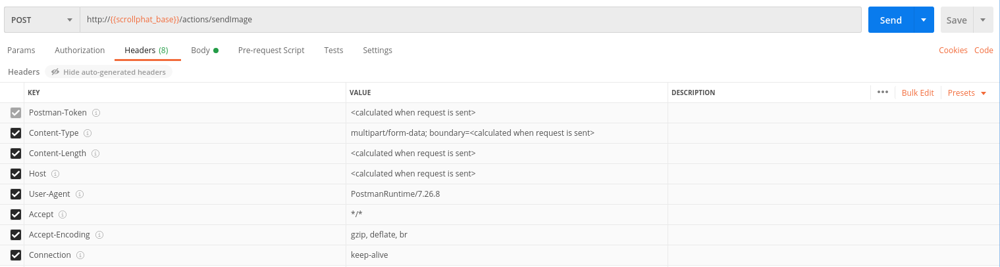

## Requirements:
* Pyhton 3.7
* Pip3 9.0.1 

## Installation:
1. Clone the repository in a local file.
2. Go into the that directory in terminal and run ``` pip3 install -r requirements.txt ``` .&nbsp;
3. Run ``` pyhton3 phat.py ```.

## Important Notes:

1. In phat.py, replace TD_DIRECTORY_ADDRESS, if you do not have a directory comment out submit_td().
2. In phat.py, replace the router address you connect.
3. You can get the Thing Description from ``` localhost:port/ ```.
4. You can use other ports as well.
 

&nbsp;
## Using SendImage Interaction:
SendImage interaction allows you to upload images to scrollphat and display that image on display. But it only accepts images with specific properties. 

Image Properties:
* File type: Bmp
* Dimensions: 17x7 Pixels
* Depth of colour or bits per pixel: 8

### How To Create bmp Image:
* **Using GIMP:**
    * &nbsp;
    * &nbsp;
    * &nbsp;
    * &nbsp;
    * &nbsp;
    * &nbsp;
    * &nbsp;
* **With Hex Editor:**

Refer to this [tutorial](https://medium.com/sysf/bits-to-bitmaps-a-simple-walkthrough-of-bmp-image-format-765dc6857393)

&nbsp;


## Example use:
&nbsp;

* **Uploading Image Using Postman**
&nbsp;


&nbsp;

&nbsp;


* **Uploading Image Using Curl Command**

```
curl --location --request POST 'http://<device ip>:8080/actions/sendImage' --form 'example.bmp=@"<directory of image>/example.bmp"'
```
> Note: How to upload the image is not properly described in the TD, read more [here.](./proposal.md)


